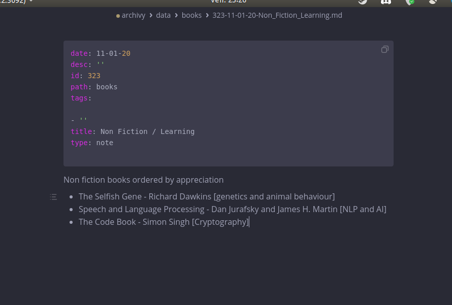

## Format

Archivy files are in the [markdown](https://daringfireball.net/projects/markdown/basics) format following the [commonmark spec](https://spec.commonmark.org/).

We've also included a few powerful extensions:


- **LaTeX**: you can render mathematical expressions like this:

```md
$$
\pi = 3.14
$$
```

- **Footnotes**:
	```md
	What does this describe? [^1]

	[^1]: test foot note.
	```

- **Tables**:
	```md
	| Column 1 | Column 2 |
	| -------- | -------- |
	| ...      | ...      |
	```

- **Code blocks with syntax highlighting**:
	````md
	```python
	print("this will be highlighted")
	x = 1337
	```
	````

There are several ways you can edit content in Archivy.

Whenever you open a note or bookmark, at the bottom of the page you'll find a few buttons that allow you to edit it.

## Ways you can edit

## Through the web interface

You can still do edits through the web app, by clicking "Toggle web editor" at the bottom.

## Locally

You can do a **local edit**. This option is only viable if running archivy on your own computer. This will open the concerned file with the default app set to edit markdown.

For example like this:


